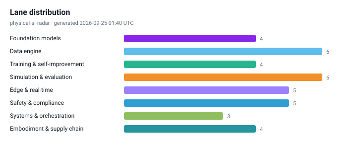

# Physical AI Radar

[](radar/INDEX.md)
[](https://noteflowai.github.io/physical-ai-radar/radar/feed.xml)
[](https://github.com/noteflowai/physical-ai-radar/actions/workflows/ci.yml)
[](LICENSE)
[](LICENSE-CONTENT)
[](docs/automation.md)

**Language: [中文](README.md) · English · [日本語](README.ja.md)**

A daily, automatically updated radar on the Physical AI frontier. It does exactly three things: **sort work into eight lanes**, **tag every claim with an evidence level**, and **state why it matters in Chinese, English and Japanese**.

How this differs from a paper list or a news aggregator:

- **Traceable evidence, no mixed units**: `[O]` first-party official, `[R]` paper/preprint, `[M]` media/secondary. Vendor self-reports and peer-reviewed results are never blended.
- **Only checkable numbers**: success rates, latency, Hz, parameter counts and data hours are extracted automatically. An item with no numbers does not get sold as a breakthrough.
- **Forward-looking without hand-waving**: the radar covers self-improvement loops, test-time compute, world-model evaluation, runtime safety, compliance timing and reliability economics — each with the original link attached.
- **Zero dependencies, reproducible**: the whole pipeline is Python standard library only, charts are hand-written SVG, and anyone can reproduce the same output locally.

**Subscribe:** [Atom](https://noteflowai.github.io/physical-ai-radar/radar/feed.xml) · [JSON Feed](https://noteflowai.github.io/physical-ai-radar/radar/feed.json) · [weekly roundups](radar/INDEX.md). Paste a feed URL into any reader; each entry carries its lane, evidence tag and key numbers.

<!-- RADAR:START -->
### Today's radar · 2026-09-25

`Generated: 2026-09-25 01:40 UTC` ｜ `Window: papers 2026-09-22 → 2026-09-25 · posts 2026-08-26 → 2026-09-25 · no repeats within 7 days (UTC)`

- `[R]` **[DreamStream: Towards Policy-Oriented Generative Simulation for End-to-End Driving](https://arxiv.org/abs/2609.26792)** — Simulation & evaluation (sim2real / closed-loop)
  - Evaluation method decides what you dare to ship: offline metrics are not closed-loop success, and the evaluation budget is shifting from human hours to GPU hours.
- `[R]` **[VLAQuantBench: Closed-Loop Evaluation of Post-Training Quantization for Vision-Language-Action Models](https://arxiv.org/abs/2609.25376)** — Simulation & evaluation (sim2real / closed-loop)
  - Evaluation method decides what you dare to ship: offline metrics are not closed-loop success, and the evaluation budget is shifting from human hours to GPU hours.
- `[R]` **[MATE: Multi-Agent Virtual Teleoperation Platform for Humanoid Collaboration Data Collection](https://arxiv.org/abs/2609.26520)** — Data engine (collection / curation / scaling) ｜ `24.1 hours`
  - Data sourcing and curation pipelines are the real moat today; they set the cost per new task.
- `[O]` **[Accelerating a ROS 2 Node with an AI Agent and NVIDIA Isaac ROS](https://developer.nvidia.com/blog/accelerating-a-ros-2-node-with-an-ai-agent-and-nvidia-isaac-ros/)** — Systems & orchestration (long-horizon / multi-policy)
  - Long-horizon systems look like an orchestrator plus a policy pool; the operated object becomes a set of capability boundaries rather than one model.
- `[M]` **[Isaac ROS 5.0 brings AI agents to robotics development, says NVIDIA](https://www.therobotreport.com/isaac-ros-5-0-brings-ai-agents-robotics-development-says-nvidia/)** — Systems & orchestration (long-horizon / multi-policy)
  - Long-horizon systems look like an orchestrator plus a policy pool; the operated object becomes a set of capability boundaries rather than one model.

[Today's radar ›](radar/daily/2026-09-25.en.md) · [Weekly roundup ›](radar/weekly/2026-W39.en.md) · [Archive ›](radar/INDEX.md)




<!-- RADAR:END -->

## The eight lanes

| Lane | What it tracks | Why it deserves its own lane |
| --- | --- | --- |
| Foundation models (VLA / WAM) | vision-language-action and world-action models, open weights | sets the starting point and cross-embodiment transfer for everything downstream |
| Data engine | teleoperation, egocentric human video, curation, scaling | sets the data cost per new task |
| Training & self-improvement | RL post-training, advantage conditioning, fleet-scale loops | decides whether a policy keeps improving after deployment |
| Simulation & evaluation | sim2real, real-to-sim, closed-loop success, eval platforms | offline metrics are not closed-loop success |
| Edge & real-time | on-device inference, quantization, async inference, control rate | a model that misses the real-time budget cannot enter the control loop |
| Safety, authority & compliance | safety filters, CBFs, ISO and regulatory dates | during the certification gap, safety rests on architecture, not certificates |
| Systems & orchestration | long-horizon tasks, orchestrators, memory, policy routing | the operated object becomes a set of capability boundaries, not one model |
| Embodiment & supply chain | humanoids, actuators, tactile, BOM and production lines | the real rate limiter on cost curve and delivery cadence |

## How to read it

1. **Check the evidence tag before the claim.** `[R]` numbers are author-reported, `[M]` shipment figures often disagree across outlets, and even `[O]` needs the distinction between "platform available" and "customer deployed".
2. **Prefer numbers over adjectives.** Each entry aims to carry a success rate, latency or data volume. No numbers means the item is still narrative.
3. **Read compliance as dates.** Standards and regulation entries state effective or stage dates so they can be copied straight into a project plan.

## How the automation works

```
scripts/publish_daily.sh (cron on a maintainer's machine, 01:40 UTC / 09:40 CST / 10:40 JST)
  └─ fetch    arXiv API (six cs.RO queries; category RSS when the API refuses) + official and press Atom/RSS (AWS / NVIDIA / DeepMind / HF / IEEE / The Robot Report)
  └─ distill  relevance gate → classify into eight lanes → extract quantitative claims → explainable score → per-lane, per-source and per-evidence caps
  └─ charts   hand-written SVG: lane distribution / daily cadence / evidence mix
  └─ render   trilingual daily page + inject three READMEs + refresh archive index and latest.json
  └─ feeds    radar/feed.json (JSON Feed 1.1) + Atom per language + this week's roundup in radar/weekly/
  └─ commit   commit and push to main only when something changed
```

The run is scheduled after the arXiv daily announcement so the first thing you read in the morning is the newest batch.

## Run it locally

```bash
git clone https://github.com/noteflowai/physical-ai-radar.git
cd physical-ai-radar

python3 -m pairadar --offline --out /tmp/radar   # no network, writes elsewhere, repo untouched
python3 -m pairadar --offline                   # no network, rewrites the pages and READMEs in place
python3 -m pairadar                             # fetch today's live items
python3 -m unittest discover -s tests           # tests
```

No pip install, no virtualenv. Python 3.10+ is enough.

Without `--out` a run **rewrites in place**: the radar block in all three READMEs,
`radar/` and `assets/` — which is what the daily job is for. Use `--out` to look
first. Either way the run log is read from the repository, so the 30-day
no-repeat window still applies.

## Layout

```
data/        sources.json (sources and weights) · taxonomy.json (lanes and signals)
             glossary.json (trilingual UI and terms) · baseline.json (curated baseline)
pairadar/    fetch / distill / charts / render / cli — standard library only
radar/       daily/YYYY-MM-DD.{zh,en,ja}.md · INDEX.md · latest.json · history.json
assets/      generated SVG charts
docs/        METHODOLOGY.md (method, translation policy, known limits)
```

## Known limits (stated up front)

- Summaries are **extractive**: the English source excerpt is shown as a quote and never machine-translated. The analytical layer above it is written per language, never translated sentence by sentence — on most days by an agent, whose every line is labelled as drafted and whose figures must already appear on that day's published page; where no draft exists the per-lane template fills in, unlabelled. [How a draft is reviewed and what it may not claim](docs/METHODOLOGY.md).
- Each language gets its own chart set, labelled in that language. These are SVG text, so the glyphs come from the reader's browser and nothing is bundled. Long names carry a curated short form in `data/taxonomy.json`; a label is trimmed only if it still does not fit, and a test asserts none currently is.
- Lane assignment is **keyword matching** (whole terms, never substrings), not classification. An item from a general-purpose blog must also name a Physical AI anchor term (robot, humanoid, VLA, world model, ...), a lane needs at least one keyword hit, and `python3 -m pairadar.lanes` flags a pick decided by a single keyword (`thin`) or close to its runner-up (`ambiguous`). A wrong lane is findable; it is not prevented.

## Deliberate choices (not limits)

These will not be "fixed". Each one is what makes the rest checkable.

- Ranking is an **explainable weighted sum**, not learned relevance. All weights live in `data/`, so a fork can retune them. An agent may propose new weights as a pull request you can read; it does not get to replace the model with one you cannot.
- Sources are limited to public machine-readable endpoints. No article scraping, no paywall bypass. This is enforced rather than promised: the drafting and reviewing agents declare `read`, `grep` and `glob` only — no shell, no network — so they can only reason over what the pipeline already fetched and published, and a test asserts it stays that way.

## Related project

The radar tracks frontier claims. [**Robot Reel**](https://huggingface.co/spaces/glayguo/robot-reel) does the other half: it records some of those claims as evidence you can inspect.

- [SmolVLA Stress Lab](https://noteflowai.github.io/robot-reel/stress/) — 30 real closed-loop rollouts of one task under reference lighting, reduced light and a shifted camera (NVIDIA L40S / CUDA inference), with paired seeds, confidence intervals, applied actions and separate inference timings
- [Butterfly Lab](https://noteflowai.github.io/robot-reel/chaos/) — twelve Newton worlds released 0.05° apart, their trajectories drawn as a 3D time sculpture
- [Paired-outcome dataset](https://huggingface.co/datasets/glayguo/robot-reel-paired-outcomes) — the recorded results, machine-readable

For items in the **Edge & real-time** and **Simulation & evaluation** lanes there is often a matching experiment over there that you can open and step through.

**Disclosure**: both projects are maintained by the same authors. That is why no entry in the curated baseline (`data/baseline.json`) points at our own work — these links live here and nowhere else.

## Contributing

PRs welcome: new machine-readable sources, evidence-tag corrections, baseline additions, better trilingual wording. Start with [CONTRIBUTING.md](CONTRIBUTING.md) and [docs/METHODOLOGY.md](docs/METHODOLOGY.md).

## License

- Code: [MIT](LICENSE)
- Content (curated text and generated pages): [CC BY 4.0](LICENSE-CONTENT)

---

*This repository is technical observation. It is not investment advice, a product commitment, or a safety certification conclusion. Paper and vendor claims are reported as such; follow the original link before citing.*
