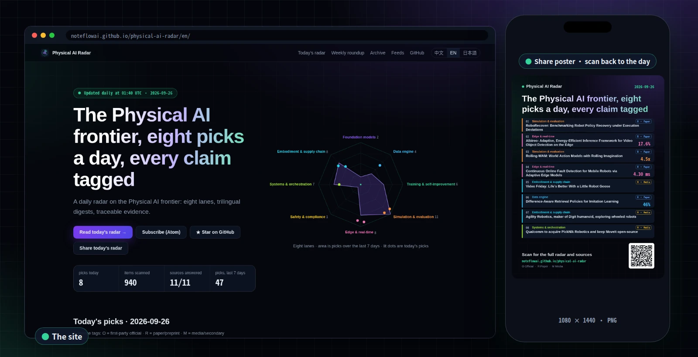
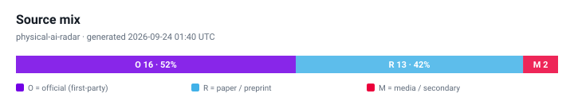
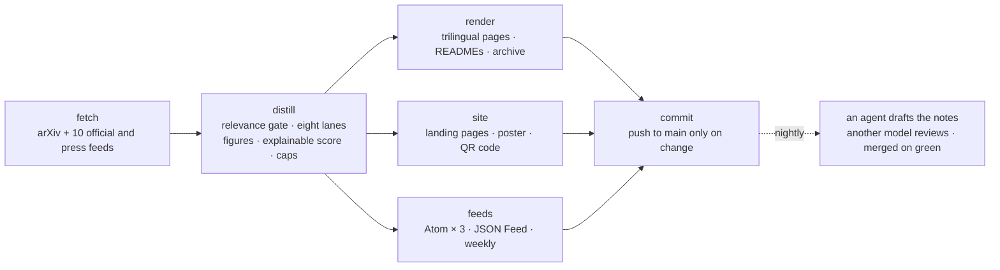

<div align="center">

<a href="https://noteflowai.github.io/physical-ai-radar/en/"></a>

# Physical AI Radar

**Eight Physical AI picks a day, sorted into eight lanes, every claim tagged with its evidence, and why it matters in Chinese, English and Japanese.**

[](https://noteflowai.github.io/physical-ai-radar/en/)
[](https://noteflowai.github.io/physical-ai-radar/radar/feed.xml)
[](radar/INDEX.md)

[](radar/INDEX.md)
[](docs/automation.md)
[](https://github.com/noteflowai/physical-ai-radar/actions/workflows/ci.yml)
[](#run-it-locally)
[](LICENSE)
[](LICENSE-CONTENT)

[中文](README.md) · **English** · [日本語](README.ja.md)

</div>

<table>
<tr>
<td width="50%" valign="top">

**🔎 Traceable evidence, no mixed units**<br>
`[O]` first-party official · `[R]` paper/preprint · `[M]` media/secondary. Vendor self-reports and peer-reviewed results are never blended.

</td>
<td width="50%" valign="top">

**📏 Only checkable numbers**<br>
Success rates, latency, Hz, parameter counts and data hours are extracted with the words around them. An item with no numbers does not get sold as a breakthrough.

</td>
</tr>
<tr>
<td width="50%" valign="top">

**🧭 Forward-looking without hand-waving**<br>
Self-improvement loops, test-time compute, world-model evaluation, runtime safety, compliance timing and reliability economics, each with the original link.

</td>
<td width="50%" valign="top">

**🧪 Zero dependencies, reproducible**<br>
Python standard library only, hand-written SVG charts; `python3 -m pairadar --offline` reproduces a page on any machine.

</td>
</tr>
</table>

<p align="center"><a href="https://noteflowai.github.io/physical-ai-radar/en/"></a><br><sub>The landing page (left) and the day's share poster, one click away (right) · captured 2026-09-26</sub></p>

> [!TIP]
> **Pass it on:** on [the site](https://noteflowai.github.io/physical-ai-radar/en/) press “Make a share image” for today's poster with a QR code, sized for X, LinkedIn, WeChat or Xiaohongshu; “Copy today's digest” turns the eight titles and links into plain text for a chat.
>
> **Subscribe:** [Atom](https://noteflowai.github.io/physical-ai-radar/radar/feed.xml) · [JSON Feed](https://noteflowai.github.io/physical-ai-radar/radar/feed.json). Paste a feed URL into any reader; each entry carries its lane, evidence tag and key numbers.

<!-- RADAR:START -->
### Today's radar · 2026-09-26

`Generated: 2026-09-26 01:40 UTC` ｜ `Window: papers 2026-09-22 → 2026-09-26 · posts 2026-08-27 → 2026-09-26 · no repeats within 30 days (UTC)`

| # | Evidence | Item | Key numbers |
| :-: | :-: | --- | --- |
| 01 | 🔵&nbsp;`R` | **[RoboRecover: Benchmarking Robot Policy Recovery under Execution Deviations](https://arxiv.org/abs/2609.28952)**<br><sub>Simulation & evaluation · arXiv 2609.28952 · 2026-09-25</sub> | — |
| 02 | 🔵&nbsp;`R` | **[Albireo: Adaptive, Energy-Efficient Inference Framework for Video Object Detection on the Edge](https://arxiv.org/abs/2609.29648)**<br><sub>Edge & real-time · arXiv 2609.29648 · 2026-09-25</sub> | `17.6%`<br>`14.4%` |
| 03 | 🔵&nbsp;`R` | **[Rolling-WAM: World Action Models with Rolling Imagination](https://arxiv.org/abs/2609.30247)**<br><sub>Simulation & evaluation · arXiv 2609.30247 · 2026-09-25</sub> | `4.5x` |
| 04 | 🔵&nbsp;`R` | **[Continuous Online Fault Detection for Mobile Robots via Adaptive Edge Models](https://arxiv.org/abs/2609.29194)**<br><sub>Edge & real-time · arXiv 2609.29194 · 2026-09-25</sub> | `4.30 ms` |
| 05 | 🟡&nbsp;`M` | **[Video Friday: Life’s Better With a Little Robot Goose](https://spectrum.ieee.org/video-friday-goose-household-robots)**<br><sub>Embodiment & supply chain · IEEE Spectrum Robotics · 2026-09-25</sub> | — |
| 06 | 🔵&nbsp;`R` | **[Difference-Aware Retrieval Policies for Imitation Learning](http://www.tri.global/research/difference-aware-retrieval-policies-imitation-learning)**<br><sub>Data engine · Toyota Research Institute · 2026-09-09</sub> | `46%` |
| 07 | 🟡&nbsp;`M` | **[Agility Robotics, maker of Digit humanoid, exploring wheeled robots](https://www.therobotreport.com/agility-robotics-maker-of-digit-humanoid-exploring-wheeled-robots/)**<br><sub>Embodiment & supply chain · The Robot Report · 2026-09-25</sub> | — |
| 08 | 🟡&nbsp;`M` | **[Qualcomm to acquire PickNik Robotics and keep MoveIt open-source](https://www.therobotreport.com/qualcomm-acquires-picknik-robotics-keep-moveit-open-source/)**<br><sub>Systems & orchestration · The Robot Report · 2026-09-23</sub> | — |

🟢 `O` Official · 🔵 `R` Paper · 🟡 `M` Media

<details><summary><b>Why it matters</b> · 01–08</summary>

1. **RoboRecover** — Preprint, not yet peer-reviewed; the text gives no real-robot results or figures. Watch how well the simulated result predicts real-robot performance.
2. **Albireo** — Preprint, not yet peer-reviewed; the text gives no real-robot results or closed-loop results. Watch whether the speed-up holds on the target hardware at control rate.
3. **Rolling-WAM** — Preprint, not yet peer-reviewed; the text gives real-robot results, closed-loop results and figures. Watch how well the simulated result predicts real-robot performance.
4. **Continuous Online Fault Detection for Mobile Robots via Adaptive Edge Models** — Preprint, not yet peer-reviewed; the text gives no closed-loop results. Watch whether the speed-up holds on the target hardware at control rate.
5. **Video Friday** — Secondary report, so check the primary source before citing; the text gives no figures. Watch price, availability and who is shipping it in volume.
6. **Difference-Aware Retrieval Policies for Imitation Learning** — Preprint, not yet peer-reviewed; the text gives no real-robot results or closed-loop results. Watch whether the data is reusable beyond the authors' own robot.
7. **Agility Robotics, maker of Digit humanoid, exploring wheeled robots** — Secondary report, so check the primary source before citing; the text gives no figures. Watch price, availability and who is shipping it in volume.
8. **Qualcomm to acquire PickNik Robotics and keep MoveIt open-source** — Secondary report, so check the primary source before citing; the text gives no figures. Watch whether it holds up over long tasks without human resets.

</details>

**[Today's radar ›](radar/daily/2026-09-26.en.md)** · [Weekly roundup ›](radar/weekly/2026-W39.en.md) · [Archive ›](radar/INDEX.md)



<!-- RADAR:END -->

## How it differs from what you already read

| | **Physical AI Radar** | Newsletters | Awesome lists | arXiv daily lists |
| --- | --- | --- | --- | --- |
| Updates | Daily at 01:40 UTC, automated | Weekly or irregular | As contributed | Daily |
| Scope | Papers + official + media, eight lanes | Editor's picks | Accumulated by topic | Papers only, all of them |
| Evidence | Every item tagged `O` / `R` / `M` | Usually untagged | Untagged | Papers only |
| Key numbers | Extracted, with the source's words around them | Depends on the author | — | Read it yourself |
| Languages | Chinese / English / Japanese, each written natively | Usually one | Usually English | English |
| Machine-readable | Atom × 3 · JSON Feed · `latest.json` | Email | Markdown | RSS / API |
| Reproducible | Rules and weights in the repo, re-runs offline | — | — | — |

It does not replace a newsletter's commentary or arXiv's completeness. It is the page you read first.

## The eight lanes

| Lane | What it tracks | Why it deserves its own lane |
| --- | --- | --- |
| Foundation models (VLA / WAM) | vision-language-action and world-action models, open weights | sets the starting point and cross-embodiment transfer for everything downstream |
| Data engine | teleoperation, egocentric human video, curation, scaling | sets the data cost per new task |
| Training & self-improvement | RL post-training, advantage conditioning, fleet-scale loops | decides whether a policy keeps improving after deployment |
| Simulation & evaluation | sim2real, real-to-sim, closed-loop success, eval platforms | offline metrics are not closed-loop success |
| Edge & real-time | on-device inference, quantization, async inference, control rate | a model that misses the real-time budget cannot enter the control loop |
| Safety, permissions & compliance | safety filters, CBFs, ISO and regulatory dates | during the certification gap, safety rests on architecture, not certificates |
| Systems & orchestration | long-horizon tasks, orchestrators, memory, policy routing | the operated object becomes a set of capability boundaries, not one model |
| Embodiment & supply chain | humanoids, actuators, tactile, BOM and production lines | the real rate limiter on cost curve and delivery cadence |

## How to read it

1. **Check the evidence tag before the claim.** `[R]` numbers are author-reported, `[M]` shipment figures often disagree across outlets, and even `[O]` needs the distinction between "platform available" and "customer deployed".
2. **Prefer numbers over adjectives.** Each entry aims to carry a success rate, latency or data volume. No numbers means the item is still narrative.
3. **Read compliance as dates.** Standards and regulation entries state effective or stage dates so they can be copied straight into a project plan.

## Take it with you: feeds and data

Everything is a static file on GitHub Pages: no account, no key.

| You want | Where |
| --- | --- |
| A feed reader | [English Atom](https://noteflowai.github.io/physical-ai-radar/radar/feed.xml) · [Chinese Atom](https://noteflowai.github.io/physical-ai-radar/radar/feed.zh.xml) · [Japanese Atom](https://noteflowai.github.io/physical-ai-radar/radar/feed.ja.xml) |
| Today, for a program | [`radar/latest.json`](https://noteflowai.github.io/physical-ai-radar/radar/latest.json): lane, evidence, score and figures per item |
| JSON Feed | [`radar/feed.json`](https://noteflowai.github.io/physical-ai-radar/radar/feed.json) |
| Slack / Discord / Teams | Any RSS bot subscribed to an Atom feed above |

```bash
R=https://noteflowai.github.io/physical-ai-radar/radar
# today's eight: evidence tag, lane, title
curl -s $R/latest.json | jq -r '.picked[] | "[\(.evidence)] \(.lane)\t\(.title)"'
# only the items with checkable numbers
curl -s $R/latest.json | jq -r '.picked[] | select(.numbers | length > 0) | "\(.numbers | join(", "))\t\(.title)"'
# the latest ten (JSON Feed 1.1)
curl -s $R/feed.json | jq -r '.items[:10][] | "\(.date_published[:10])  \(.title)  \(.url)"'
```

The content is [CC BY 4.0](LICENSE-CONTENT): repost it, build a digest on it, feed it to your own agent, with attribution and a link back to the item.

## How the automation works



`scripts/publish_daily.sh` runs from cron on a maintainer's machine at 01:40 UTC (09:40 CST / 10:40 JST), after the arXiv daily announcement, so the first thing you read in the morning is the newest batch.

<details>
<summary>Step by step</summary>

```
scripts/publish_daily.sh (cron on a maintainer's machine, 01:40 UTC / 09:40 CST / 10:40 JST)
  └─ fetch    arXiv API (six cs.RO queries; category RSS when the API refuses) + official and press Atom/RSS (AWS / NVIDIA / DeepMind / HF / TRI / IEEE / The Robot Report / Leiphone / MONOist)
  └─ distill  relevance gate → classify into eight lanes → extract quantitative claims → explainable score → per-lane, per-source and per-evidence caps
  └─ charts   hand-written SVG: lane distribution / daily cadence / evidence mix / README banner
  └─ render   trilingual daily page + inject three READMEs + refresh archive index and latest.json
  └─ feeds    radar/feed.json (JSON Feed 1.1) + Atom per language + this week's roundup in radar/weekly/
  └─ site     landing pages index.html · en/ · ja/ (dark theme, lane radar, share poster and QR code)
  └─ commit   commit and push to main only when something changed
```

</details>

## Run it locally

```bash
git clone https://github.com/noteflowai/physical-ai-radar.git
cd physical-ai-radar

python3 -m pairadar --offline --out /tmp/radar   # no network, writes elsewhere, repo untouched
python3 -m pairadar --offline                   # no network, rewrites the pages and READMEs in place
python3 -m pairadar                             # fetch today's live items
python3 -m unittest discover -s tests           # tests
```

No pip install, no virtualenv. Python 3.10+ is enough.

Without `--out` a run **rewrites in place**: the radar block in all three READMEs,
`radar/` and `assets/` — which is what the daily job is for. Use `--out` to look
first. Either way the run log is read from the repository, so the 30-day
no-repeat window still applies.

<details>
<summary>Layout</summary>

```
data/        sources.json (sources and weights) · taxonomy.json (lanes and signals)
             glossary.json (trilingual UI and terms) · baseline.json (curated baseline)
pairadar/    fetch / distill / charts / banner / render / site / qr / cli — standard library only
radar/       daily/YYYY-MM-DD.{zh,en,ja}.md · INDEX.md · latest.json · history.json
assets/      generated SVG charts and README banners · site.css · site.js · social cards og.*.png
             · showcase.*.webp (the README screenshot of the site and poster, taken by hand)
docs/        METHODOLOGY.md (method, translation policy, known limits)
```

</details>

## Known limits (stated up front)

- Summaries are **extractive**: the English source excerpt is shown as a quote and never machine-translated. The analytical layer above it is written per language, never translated sentence by sentence — on most days by an agent, whose every line is labelled as drafted and whose figures must already appear on that day's published page; where no draft exists the per-lane template fills in, unlabelled. [How a draft is reviewed and what it may not claim](docs/METHODOLOGY.md).
- Each language gets its own chart set, labelled in that language. These are SVG text, so the glyphs come from the reader's browser and nothing is bundled. Long names carry a curated short form in `data/taxonomy.json`; a label is trimmed only if it still does not fit, and a test asserts none currently is.
- Lane assignment is **keyword matching** (whole terms, never substrings), not classification. An item from a general-purpose blog must also name a Physical AI anchor term (robot, humanoid, VLA, world model, ...), a lane needs at least one keyword hit, and `python3 -m pairadar.lanes` flags a pick decided by a single keyword (`thin`) or close to its runner-up (`ambiguous`). A wrong lane is findable; it is not prevented.

## Deliberate choices (not limits)

These will not be "fixed". Each one is what makes the rest checkable.

- Ranking is an **explainable weighted sum**, not learned relevance. All weights live in `data/`, so a fork can retune them. An agent may propose new weights as a pull request you can read; it does not get to replace the model with one you cannot.
- Sources are limited to public machine-readable endpoints. No article scraping, no paywall bypass. This is enforced rather than promised: the drafting and reviewing agents declare `read`, `grep` and `glob` only — no shell, no network — so they can only reason over what the pipeline already fetched and published, and a test asserts it stays that way.

## Related project

The radar tracks frontier claims. [**Robot Reel**](https://huggingface.co/spaces/glayguo/robot-reel) does the other half: it records some of those claims as evidence you can inspect.

- [SmolVLA Stress Lab](https://noteflowai.github.io/robot-reel/stress/) — 30 real closed-loop rollouts of one task under reference lighting, reduced light and a shifted camera (NVIDIA L40S / CUDA inference), with paired seeds, confidence intervals, applied actions and separate inference timings
- [Butterfly Lab](https://noteflowai.github.io/robot-reel/chaos/) — twelve Newton worlds released 0.05° apart, their trajectories drawn as a 3D time sculpture
- [Paired-outcome dataset](https://huggingface.co/datasets/glayguo/robot-reel-paired-outcomes) — the recorded results, machine-readable

For items in the **Edge & real-time** and **Simulation & evaluation** lanes there is often a matching experiment over there that you can open and step through.

**Disclosure**: both projects are maintained by the same authors. That is why no entry in the curated baseline (`data/baseline.json`) points at our own work — these links live here and nowhere else.

## Contributing

PRs welcome: new machine-readable sources, evidence-tag corrections, baseline additions, better trilingual wording. Start with [CONTRIBUTING.md](CONTRIBUTING.md) and [docs/METHODOLOGY.md](docs/METHODOLOGY.md).

## License

- Code: [MIT](LICENSE)
- Content (curated text and generated pages): [CC BY 4.0](LICENSE-CONTENT)


<div align="center">

**Useful? Give it a ⭐ and see you tomorrow at 01:40 UTC.** Pass today's radar on: [the site](https://noteflowai.github.io/physical-ai-radar/en/) ·
[post to X](https://twitter.com/intent/tweet?text=Physical%20AI%20Radar%3A%20eight%20picks%20a%20day%2C%20every%20claim%20tagged&url=https%3A%2F%2Fgithub.com%2Fnoteflowai%2Fphysical-ai-radar) ·
[LinkedIn](https://www.linkedin.com/sharing/share-offsite/?url=https%3A%2F%2Fgithub.com%2Fnoteflowai%2Fphysical-ai-radar)

</div>

---

*This repository is technical observation. It is not investment advice, a product commitment, or a safety certification conclusion. Paper and vendor claims are reported as such; follow the original link before citing.*
