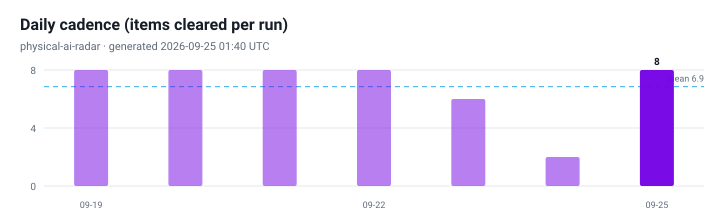

# Physical AI Radar

[](https://github.com/noteflowai/physical-ai-radar/actions/workflows/daily.yml)
[](https://github.com/noteflowai/physical-ai-radar/actions/workflows/ci.yml)
[](LICENSE)
[](LICENSE-CONTENT)
[](.github/workflows/daily.yml)

**Language: [中文](README.md) · English · [日本語](README.ja.md)**

A daily, automatically updated radar on the Physical AI frontier. It does exactly three things: **sort work into eight lanes**, **tag every claim with an evidence level**, and **state why it matters in Chinese, English and Japanese**.

How this differs from a paper list or a news aggregator:

- **Traceable evidence, no mixed units**: `[O]` first-party official, `[R]` paper/preprint, `[M]` media/secondary. Vendor self-reports and peer-reviewed results are never blended.
- **Only checkable numbers**: success rates, latency, Hz, parameter counts and data hours are extracted automatically. An item with no numbers does not get sold as a breakthrough.
- **Forward-looking without hand-waving**: the radar covers self-improvement loops, test-time compute, world-model evaluation, runtime safety, compliance timing and reliability economics — each with the original link attached.
- **Zero dependencies, reproducible**: the whole pipeline is Python standard library only, charts are hand-written SVG, and anyone can reproduce the same output locally.

<!-- RADAR:START -->
### Today's radar · 2026-09-19

`Generated: 2026-09-19 08:09 UTC` ｜ `Window: 2026-09-16 → 2026-09-19 (UTC)`

- `[R]` **[GeoAAC: Geometry-Based Adaptive Action Chunking from Denoising Trajectories in VLA Policies](http://arxiv.org/abs/2609.20776v1)** — Foundation models (VLA / WAM)
  - Changes at the foundation-model layer reset the starting point for every downstream task: how much of your own data you need, and whether it transfers across embodiments.
- `[R]` **[rMuscle: Robotic Muscle Memory for Efficient Vision-Language-Action Model Inference](http://arxiv.org/abs/2609.19104v1)** — Edge & real-time (on-device inference / control rate)
  - On-device latency and control rate are hard constraints: however capable the model, it cannot enter the control loop if it misses the real-time budget.
- `[R]` **[PASSAGE: Scaling Scene-Aligned Motion Learning for Perceptive Humanoid Traversal in Cluttered Environments](http://arxiv.org/abs/2609.18732v1)** — Edge & real-time (on-device inference / control rate) ｜ `50 Hz` · `48.1%`
  - On-device latency and control rate are hard constraints: however capable the model, it cannot enter the control loop if it misses the real-time budget.
- `[R]` **[StageGuard: Learning Stage Transitions for Long-Horizon Robot Tasks via Agentic Distillation](http://arxiv.org/abs/2609.20791v1)** — Systems & orchestration (long-horizon / multi-policy)
  - Long-horizon systems look like an orchestrator plus a policy pool; the operated object becomes a set of capability boundaries rather than one model.
- `[R]` **[Agile-WAM: An Agile Tactile World Action Model for Contact-Rich Robot Control](http://arxiv.org/abs/2609.20761v1)** — Foundation models (VLA / WAM) ｜ `11.9 ms`
  - Changes at the foundation-model layer reset the starting point for every downstream task: how much of your own data you need, and whether it transfers across embodiments.

[Today's radar ›](radar/daily/2026-09-19.en.md) · [Archive ›](radar/INDEX.md)



<!-- RADAR:END -->

## The eight lanes

| Lane | What it tracks | Why it deserves its own lane |
| --- | --- | --- |
| Foundation models (VLA / WAM) | vision-language-action and world-action models, open weights | sets the starting point and cross-embodiment transfer for everything downstream |
| Data engine | teleoperation, egocentric human video, curation, scaling | sets the data cost per new task |
| Training & self-improvement | RL post-training, advantage conditioning, fleet-scale loops | decides whether a policy keeps improving after deployment |
| Simulation & evaluation | sim2real, real-to-sim, closed-loop success, eval platforms | offline metrics are not closed-loop success |
| Edge & real-time | on-device inference, quantization, async inference, control rate | a model that misses the real-time budget cannot enter the control loop |
| Safety, authority & compliance | safety filters, CBFs, ISO and regulatory dates | during the certification gap, safety rests on architecture, not certificates |
| Systems & orchestration | long-horizon tasks, orchestrators, memory, policy routing | the operated object becomes a set of capability boundaries, not one model |
| Embodiment & supply chain | humanoids, actuators, tactile, BOM and production lines | the real rate limiter on cost curve and delivery cadence |

## How to read it

1. **Check the evidence tag before the claim.** `[R]` numbers are author-reported, `[M]` shipment figures often disagree across outlets, and even `[O]` needs the distinction between "platform available" and "customer deployed".
2. **Prefer numbers over adjectives.** Each entry aims to carry a success rate, latency or data volume. No numbers means the item is still narrative.
3. **Read compliance as dates.** Standards and regulation entries state effective or stage dates so they can be copied straight into a project plan.

## How the automation works

```
GitHub Actions (cron 01:30 UTC / 09:30 CST / 10:30 JST)
  └─ fetch    arXiv API (six cs.RO queries) + official Atom/RSS (AWS / NVIDIA / DeepMind / HF / IEEE)
  └─ distill  classify into eight lanes → extract quantitative claims → explainable score → per-lane caps
  └─ charts   hand-written SVG: lane distribution / daily cadence / evidence mix
  └─ render   trilingual daily page + inject three READMEs + refresh archive index and latest.json
  └─ commit   commit only when something changed ([skip ci])
```

The run is scheduled after the arXiv daily announcement so the first thing you read in the morning is the newest batch.

## Run it locally

```bash
git clone https://github.com/noteflowai/physical-ai-radar.git
cd physical-ai-radar

python3 -m pairadar --offline          # no network, curated baseline only
python3 -m pairadar                    # fetch today's live items
python3 -m unittest discover -s tests  # tests
```

No pip install, no virtualenv. Python 3.10+ is enough.

## Layout

```
data/        sources.json (sources and weights) · taxonomy.json (lanes and signals)
             glossary.json (trilingual UI and terms) · baseline.json (curated baseline)
pairadar/    fetch / distill / charts / render / cli — standard library only
radar/       daily/YYYY-MM-DD.{zh,en,ja}.md · INDEX.md · latest.json · history.json
assets/      generated SVG charts
docs/        METHODOLOGY.md (method, translation policy, known limits)
```

## Known limits (stated up front)

- Summaries are **extractive**: the English source excerpt is shown as a quote and never machine-translated. The Chinese and Japanese analytical layer is authored from templates plus a curated glossary, not translated sentence by sentence.
- Chart labels stay in English: rendering CJK glyphs would require bundling a font into CI and would cost reproducibility.
- Ranking is an **explainable weighted sum**, not learned relevance. All weights live in `data/`, so a fork can retune them.
- Sources are limited to public machine-readable endpoints. No article scraping, no paywall bypass.

## Contributing

PRs welcome: new machine-readable sources, evidence-tag corrections, baseline additions, better trilingual wording. Start with [CONTRIBUTING.md](CONTRIBUTING.md) and [docs/METHODOLOGY.md](docs/METHODOLOGY.md).

## License

- Code: [MIT](LICENSE)
- Content (curated text and generated pages): [CC BY 4.0](LICENSE-CONTENT)

---

*This repository is technical observation. It is not investment advice, a product commitment, or a safety certification conclusion. Paper and vendor claims are reported as such; follow the original link before citing.*
