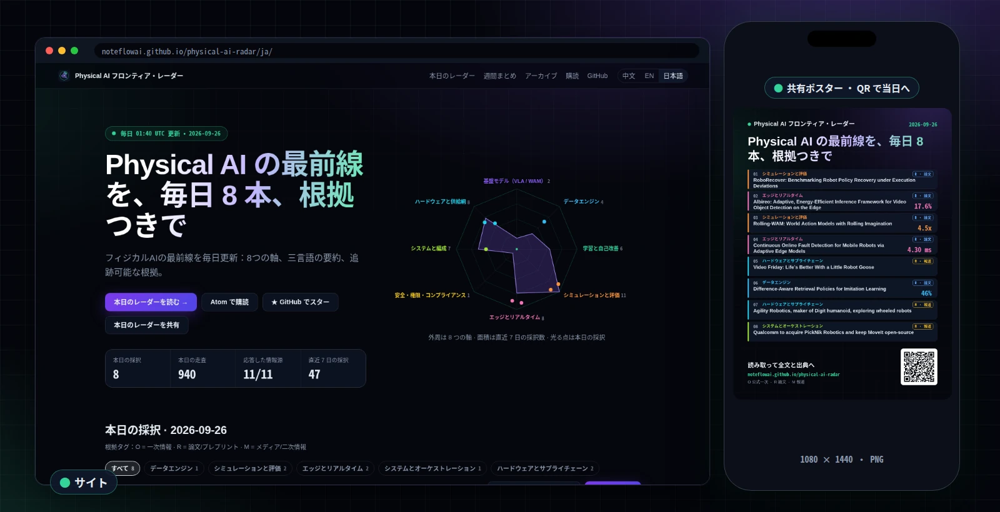
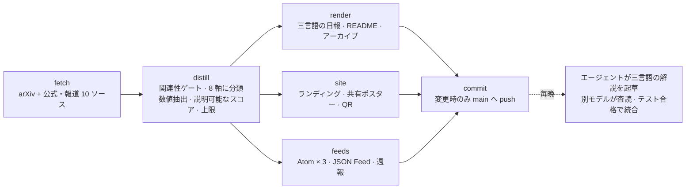

<div align="center">

<a href="https://noteflowai.github.io/physical-ai-radar/ja/"></a>

# Physical AI フロンティア・レーダー

**Physical AI の最前線を毎日 8 本。8 つの軸に分類し、すべての主張に根拠タグを付け、「なぜ重要か」を中国語・英語・日本語で書きます。**

[](https://noteflowai.github.io/physical-ai-radar/ja/)
[](https://noteflowai.github.io/physical-ai-radar/radar/feed.ja.xml)
[](radar/INDEX.md)

[](radar/INDEX.md)
[](docs/automation.md)
[](https://github.com/noteflowai/physical-ai-radar/actions/workflows/ci.yml)
[](#ローカル実行)
[](LICENSE)
[](LICENSE-CONTENT)

[中文](README.md) · [English](README.en.md) · **日本語**

</div>

<table>
<tr>
<td width="50%" valign="top">

**🔎 根拠が追跡可能で、単位が混ざらない**<br>
`[O]` 一次情報 · `[R]` 論文/プレプリント · `[M]` メディア/二次情報。ベンダーの自己報告と査読結果を混ぜません。

</td>
<td width="50%" valign="top">

**📏 検証できる数値のみ**<br>
成功率、遅延、Hz、パラメータ数、データ時間を原文の文脈ごと自動抽出。数値のない項目を「ブレイクスルー」として売りません。

</td>
</tr>
<tr>
<td width="50%" valign="top">

**🧭 前瞻的だが曖昧ではない**<br>
自己改善ループ、推論時計算、世界モデルによる評価、実行時安全、規制スケジュール、信頼性の経済性。必ず原典リンクを添えます。

</td>
<td width="50%" valign="top">

**🧪 依存ゼロで再現可能**<br>
Python 標準ライブラリのみ、図は手書き SVG。`python3 -m pairadar --offline` でどのマシンでも同じページを再現できます。

</td>
</tr>
</table>

<p align="center"><a href="https://noteflowai.github.io/physical-ai-radar/ja/"></a><br><sub>ランディングページ（左）とワンクリックで作れる当日の共有ポスター（右） · 2026-09-26 撮影</sub></p>

> [!TIP]
> **共有する：** [サイト](https://noteflowai.github.io/physical-ai-radar/ja/)で「共有画像を作成」を押すと、QR コード付きの当日ポスターができます。X、LINE、WeChat にそのまま貼れます。「本日のダイジェストをコピー」で 8 本のタイトルとリンクをテキストにしてチャットへ。
>
> **購読：** [Atom（日本語）](https://noteflowai.github.io/physical-ai-radar/radar/feed.ja.xml) · [JSON Feed（英語）](https://noteflowai.github.io/physical-ai-radar/radar/feed.json)。フィードリーダーに URL を貼るだけで、各項目の軸・根拠区分・主要な数値が届きます。

<!-- RADAR:START -->
### 本日のレーダー · 2026-09-26

`生成時刻: 2026-09-26 01:40 UTC` ｜ `対象期間: 論文 2026-09-22 → 2026-09-26 · ブログ・報道 2026-08-27 → 2026-09-26 · 30 日以内の重複なし (UTC)`

| # | 根拠 | 項目 | 主要数値 |
| :-: | :-: | --- | --- |
| 01 | 🔵&nbsp;`R` | **[RoboRecover: Benchmarking Robot Policy Recovery under Execution Deviations](https://arxiv.org/abs/2609.28952)**<br><sub>シミュレーションと評価 · arXiv 2609.28952 · 2026-09-25</sub> | — |
| 02 | 🔵&nbsp;`R` | **[Albireo: Adaptive, Energy-Efficient Inference Framework for Video Object Detection on the Edge](https://arxiv.org/abs/2609.29648)**<br><sub>エッジとリアルタイム · arXiv 2609.29648 · 2026-09-25</sub> | `17.6%`<br>`14.4%` |
| 03 | 🔵&nbsp;`R` | **[Rolling-WAM: World Action Models with Rolling Imagination](https://arxiv.org/abs/2609.30247)**<br><sub>シミュレーションと評価 · arXiv 2609.30247 · 2026-09-25</sub> | `4.5x` |
| 04 | 🔵&nbsp;`R` | **[Continuous Online Fault Detection for Mobile Robots via Adaptive Edge Models](https://arxiv.org/abs/2609.29194)**<br><sub>エッジとリアルタイム · arXiv 2609.29194 · 2026-09-25</sub> | `4.30 ms` |
| 05 | 🟡&nbsp;`M` | **[Video Friday: Life’s Better With a Little Robot Goose](https://spectrum.ieee.org/video-friday-goose-household-robots)**<br><sub>ハードウェアとサプライチェーン · IEEE Spectrum Robotics · 2026-09-25</sub> | — |
| 06 | 🔵&nbsp;`R` | **[Difference-Aware Retrieval Policies for Imitation Learning](http://www.tri.global/research/difference-aware-retrieval-policies-imitation-learning)**<br><sub>データエンジン · Toyota Research Institute · 2026-09-09</sub> | `46%` |
| 07 | 🟡&nbsp;`M` | **[Agility Robotics, maker of Digit humanoid, exploring wheeled robots](https://www.therobotreport.com/agility-robotics-maker-of-digit-humanoid-exploring-wheeled-robots/)**<br><sub>ハードウェアとサプライチェーン · The Robot Report · 2026-09-25</sub> | — |
| 08 | 🟡&nbsp;`M` | **[Qualcomm to acquire PickNik Robotics and keep MoveIt open-source](https://www.therobotreport.com/qualcomm-acquires-picknik-robotics-keep-moveit-open-source/)**<br><sub>システムとオーケストレーション · The Robot Report · 2026-09-23</sub> | — |

🟢 `O` 公式一次 · 🔵 `R` 論文 · 🟡 `M` 報道

<details><summary><b>重要な理由</b> · 01–08</summary>

1. **RoboRecover** — `AI 下書き` 既存ベンチマークは所定の初期状態から全軌道を評価するのが通例だと著者は述べる。自社の評価も同様なら、実行途中の逸脱からの復帰能力は測れていない。閉ループ結果ありとされるが、本ページに数値はない。
2. **Albireo** — `AI 下書き` 長いフレーム列に検出器を回し続ける知覚系なら、著者自己申告で Thor で 17.6%、Orin で 14.4% の省電力、コード公開あり。本ページにロボットタスクや制御ループの結果はなく、まず自機の基板で再測定を。
3. **Rolling-WAM** — `AI 下書き` 映像と行動の同時デノイズで再計画周期が遅すぎると世界行動モデルを見送っていたなら、著者自己申告の定常再計画 4.5 倍高速化と実機・閉ループ結果は再検討に値する。成功率の数値は本ページにない。
4. **Continuous Online Fault Detection for Mobile Robots via Adaptive Edge Models** — `AI 下書き` Student モデルは CPU で推論 4.30 ms（著者自己申告）かつ継続的にオンライン適応できるとされ、GPU なしで制御ループの横に故障検知を常駐させる選択肢になる。実機結果ありだが、検知後の閉ループ対処の検証は本ページにない。
5. **Video Friday** — `AI 下書き` 動画まとめ回であり、ページ上の文章は The Robot Works の小さなロボットガチョウに触れるだけ。ハードウェアの手がかりを拾う入口として見て、仕様・価格・出荷に関する主張の根拠にはしないこと。
6. **Difference-Aware Retrieval Policies for Imitation Learning** — `AI 下書き` 行動クローン方策が展開時の誤差蓄積で分布外に逸れて困っているなら、著者自己申告で検索ベース方策が標準の行動クローンを 15-46% 上回るとする。実機・閉ループの結果は本ページになく、切り替え前に自環境で検証を。
7. **Agility Robotics, maker of Digit humanoid, exploring wheeled robots** — `AI 下書き` 業界メディア一報によれば Digit のメーカーが環境ごとに車輪を含む複数形態を検討中で、ヒューマノイド先行のベンダーも脚だけに賭けていないことを示す。機体選定中なら、実際に出荷している形態をベンダーに確認を。
8. **Qualcomm to acquire PickNik Robotics and keep MoveIt open-source** — `AI 下書き` MoveIt を操作スタックに使っているなら、Qualcomm がオープンソースを維持しつつ Dragonwing と Arduino を統合するという報道が意味するのは、ライセンス変更ではなく特定チップベンダーへのロードマップ偏りという短期リスク。一次発表で確認を。

</details>

**[本日のレーダー ›](radar/daily/2026-09-26.ja.md)** · [週間まとめ ›](radar/weekly/2026-W39.ja.md) · [アーカイブ ›](radar/INDEX.md)


<!-- RADAR:END -->

## よくある情報源との違い

| | **Physical AI フロンティア・レーダー** | ニュースレター | awesome リスト | arXiv 日次リスト |
| --- | --- | --- | --- | --- |
| 更新 | 毎日 01:40 UTC、自動 | 週次または不定期 | 貢献次第 | 毎日 |
| 範囲 | 論文 + 公式 + 報道、8 つの軸 | 編集者の選定 | テーマ別に蓄積 | 論文のみ、全件 |
| 根拠 | 全項目に `O` / `R` / `M` | 通常なし | なし | 論文のみ |
| 主要数値 | 自動抽出、原文の文脈つき | 著者次第 | — | 自分で読む |
| 言語 | 中国語・英語・日本語をそれぞれ書き下ろし | 通常 1 言語 | 通常英語 | 英語 |
| 機械可読 | Atom × 3 · JSON Feed · `latest.json` | メール | Markdown | RSS / API |
| 再現性 | ルールと重みはすべてリポジトリに、オフラインで再実行可 | — | — | — |

ニュースレターの論評や arXiv の網羅性の代わりではありません。朝いちばんに開く 1 ページです。

## 8つの軸

| 軸 | 追跡対象 | 独立させる理由 |
| --- | --- | --- |
| 基盤モデル（VLA / WAM） | 視覚言語行動モデル、世界行動モデル、公開重み | 下流タスクの出発点と機体横断の転移可否を決める |
| データエンジン | 遠隔操作、一人称人間動画、精査、スケーリング | 新規タスクあたりのデータコストを決める |
| 学習と自己改善 | RL 事後学習、advantage conditioning、機群規模の循環 | 配備後も方策が強くなれるかを決める |
| シミュレーションと評価 | sim2real、real-to-sim、閉ループ成功率、評価基盤 | オフライン指標は閉ループ成功率ではない |
| エッジとリアルタイム | オンデバイス推論、量子化、非同期推論、制御周期 | 実時間予算を超えるモデルは制御ループに入れない |
| 安全・権限・規制 | セーフティフィルタ、CBF、ISO と規制日程 | 認証の空白期間では、安全は証明書でなく設計に依存する |
| システムとオーケストレーション | 長期タスク、オーケストレーター、記憶、方策ルーティング | 運用対象が単一モデルから能力境界の集合になる |
| ハードウェアとサプライチェーン | ヒューマノイド、アクチュエータ、触覚、BOM と生産ライン | コスト曲線と納入ペースの実際の律速 |

## 読み方

1. **主張より先に根拠タグを見る**。`[R]` の数値は著者の自己報告、`[M]` の出荷台数は媒体間で食い違うことが多く、`[O]` でも「プラットフォーム提供可能」と「顧客が導入済み」は別物です。
2. **形容詞より数値**。各項目は成功率・遅延・データ量を伴うことを目標にしています。数値がなければ、その項目はまだ物語の段階です。
3. **規制は日付で読む**。標準と規制の項目は発効日や段階日を明記し、プロジェクト計画にそのまま転記できます。

## 持ち出す：購読とデータ

すべて GitHub Pages 上の静的ファイルです。アカウントもキーも不要です。

| 用途 | 場所 |
| --- | --- |
| フィードリーダー | [日本語 Atom](https://noteflowai.github.io/physical-ai-radar/radar/feed.ja.xml) · [英語 Atom](https://noteflowai.github.io/physical-ai-radar/radar/feed.xml) · [中国語 Atom](https://noteflowai.github.io/physical-ai-radar/radar/feed.zh.xml) |
| プログラムから当日分 | [`radar/latest.json`](https://noteflowai.github.io/physical-ai-radar/radar/latest.json)：項目ごとの軸・根拠・スコア・数値 |
| JSON Feed | [`radar/feed.json`](https://noteflowai.github.io/physical-ai-radar/radar/feed.json) |
| Slack / Discord / Teams | 上の Atom を購読した RSS ボットで配信できます |

```bash
R=https://noteflowai.github.io/physical-ai-radar/radar
# 本日の 8 本：根拠タグ・軸・タイトル
curl -s $R/latest.json | jq -r '.picked[] | "[\(.evidence)] \(.lane)\t\(.title)"'
# 検証できる数値つきの項目だけ
curl -s $R/latest.json | jq -r '.picked[] | select(.numbers | length > 0) | "\(.numbers | join(", "))\t\(.title)"'
# 直近 10 本（JSON Feed 1.1）
curl -s $R/feed.json | jq -r '.items[:10][] | "\(.date_published[:10])  \(.title)  \(.url)"'
```

コンテンツは [CC BY 4.0](LICENSE-CONTENT) です。転載、ダイジェスト作成、自分のエージェントへの入力も、出典を明記し元の項目にリンクすれば自由です。

## 自動更新の仕組み



`scripts/publish_daily.sh` はメンテナーのマシン上の cron で 01:40 UTC（09:40 CST / 10:40 JST）に実行されます。arXiv の当日公告後なので、朝いちばんに最新の一群が読めます。

<details>
<summary>各ステップの詳細</summary>

```
scripts/publish_daily.sh（メンテナーのマシン上の cron、01:40 UTC / 09:40 CST / 10:40 JST）
  └─ fetch    arXiv API（cs.RO の6クエリ、API が応答しない日はカテゴリ RSS）+ 公式・報道の Atom/RSS（AWS / NVIDIA / DeepMind / HF / TRI / IEEE / The Robot Report / 雷峰网 / MONOist）
  └─ distill  関連性ゲート → 8軸に分類 → 定量指標を抽出 → 説明可能なスコア → 軸・ソース・根拠区分ごとの上限で選抜
  └─ charts   手書き SVG：軸分布 / 日次推移 / 根拠構成 / README バナー
  └─ render   三言語の日報 + 3つの README へ注入 + アーカイブ索引と latest.json を更新
  └─ feeds    radar/feed.json（JSON Feed 1.1）+ 各言語の Atom + 今週のまとめ（radar/weekly/）
  └─ site     ランディングページ index.html · en/ · ja/（ダークテーマ、レーダー図、共有ポスターと QR コード）
  └─ commit   変更があるときのみコミットして main に push
```

</details>

## ローカル実行

```bash
git clone https://github.com/noteflowai/physical-ai-radar.git
cd physical-ai-radar

python3 -m pairadar --offline --out /tmp/radar   # 通信なし・別の場所へ出力し、リポジトリは変更しない
python3 -m pairadar --offline                   # 通信なし・日報と README をその場で書き換える
python3 -m pairadar                             # 当日の新規項目を取得
python3 -m unittest discover -s tests           # テスト
```

pip install も仮想環境も不要。Python 3.10 以上で動きます。

`--out` を付けない実行は、三つの README のレーダー区画・`radar/`・`assets/` を
**その場で書き換えます**（日次ジョブの動作そのものです）。まず内容を確認したい
場合は `--out` を使ってください。どちらの場合も実行ログはリポジトリから読むため、
30 日以内の重複除外はそのまま機能します。

<details>
<summary>ディレクトリ構成</summary>

```
data/        sources.json（出典と重み）· taxonomy.json（軸とシグナル）
             glossary.json（三言語 UI と用語）· baseline.json（キュレーション基準）
pairadar/    fetch / distill / charts / banner / render / site / qr / cli —— すべて標準ライブラリ
radar/       daily/YYYY-MM-DD.{zh,en,ja}.md · INDEX.md · latest.json · history.json
assets/      自動生成の SVG 図と README バナー · site.css · site.js · 共有カード og.*.png
             · showcase.*.webp（README 用のサイトとポスターのスクリーンショット、手動で撮影）
docs/        METHODOLOGY.md（方法論・翻訳方針・既知の限界）
```

</details>

## 既知の限界（先に明示します）

- 要約は**抽出型**です。英語原文の抜粋は引用として示し、機械翻訳しません。その上の分析層は**言語ごとに執筆**し、逐語訳は行いません。多くの日はエージェントが下書きし、各行に下書きであることを明記し、記載する数値はその日の公開パージに既に存在するものに限ります。下書きがない言語は軸ごとのテンプレートが補い、注記は付きません。[下書きの査読と主張できないこと](docs/METHODOLOGY.md)。
- 図は**言語ごとに作成**し、ラベルもその言語で記します。SVG テキストなのでグリフは読者のブラウザが描画し、フォントの同梱はありません。長い名称には `data/taxonomy.json` に短缮形を用意し、それでも入らない場合のみ切り詰めます。現在切り詰めされたラベルがないことはテストで担保しています。
- 軸の判定は**キーワード一致**（部分文字列ではなく語単位）であり、分類モデルではありません。汎用ブログの項目は Physical AI のアンカー語（robot、humanoid、VLA、world model など）も含む必要があり、軸には少なくとも1件の一致が必要で、`python3 -m pairadar.lanes` は単一のキーワードで決まった項目（`thin`）や次点と近い項目（`ambiguous`）を示します。誤った軸は**見つけられます**が、防がれてはいません。

## 意図した選択（限界ではありません）

これらは「修正」しません。残りを検証可能にしているのは、この選択そのものです。

- ランキングは**説明可能な重み付き和**であり、学習された関連度ではありません。重みは `data/` にあり、フォークして調整できます。エージェントは新しい重みをプルリクエストとして提案できますが、読めないモデルに置き換えることはできません。
- 出典は公開された機械可読エンドポイントに限定し、本文のスクレイピングや有料壁の回避は行いません。これは約束ではなく**強制**です。下書きと査読のエージェントは `read`・`grep`・`glob` のみを宣言し、シェルもネットワークも持たないため、パイプラインが既に取得・公開したものの上でしか推論できません。その状態はテストで担保しています。

## 関連プロジェクト

レーダーは最前線の主張を追跡します。[**Robot Reel**](https://huggingface.co/spaces/glayguo/robot-reel) はその先を担い、主張の一部を検証できる記録に変えます。

- [SmolVLA Stress Lab](https://noteflowai.github.io/robot-reel/stress/) — 同一タスクを参照照明・減光・カメラ移動の三条件で回した 30 回の実クローズドループ実行（NVIDIA L40S / CUDA 推論）。対応シード、信頼区間、適用アクション、推論時間を個別に記録
- [Butterfly Lab](https://noteflowai.github.io/robot-reel/chaos/) — 0.05° ずつ異なる初期角の Newton 世界 12 個。軌跡は 3D の時間彫刻になります
- [対応結果データセット](https://huggingface.co/datasets/glayguo/robot-reel-paired-outcomes) — 記録された結果を機械可読な形で

「エッジとリアルタイム性」「シミュレーションと評価」レーンの項目には、あちらで実際に開いて確認できる対照実験がある場合が多いです。

**開示**：両プロジェクトは同じ著者が維持しています。そのためキュレーション基準（`data/baseline.json`）に自分たちの成果物は入れておらず、これらのリンクはここにのみ置いています。

## 貢献

PR を歓迎します：機械可読な新規出典、根拠タグの修正、基準項目の追加、三言語表現の改善。まず [CONTRIBUTING.md](CONTRIBUTING.md) と [docs/METHODOLOGY.md](docs/METHODOLOGY.md) をご覧ください。

## ライセンス

- コード：[MIT](LICENSE)
- コンテンツ（キュレーション文と生成ページ）：[CC BY 4.0](LICENSE-CONTENT)


<div align="center">

**役に立ったら ⭐ Star を。明朝 01:40 UTC にまた。** 今日のレーダーを共有： [サイト](https://noteflowai.github.io/physical-ai-radar/ja/) ·
[X に投稿](https://twitter.com/intent/tweet?text=Physical%20AI%20%E3%83%95%E3%83%AD%E3%83%B3%E3%83%86%E3%82%A3%E3%82%A2%E3%83%BB%E3%83%AC%E3%83%BC%E3%83%80%E3%83%BC%EF%BC%9A%E6%AF%8E%E6%97%A5%208%20%E6%9C%AC%E3%80%81%E6%A0%B9%E6%8B%A0%E3%81%A4%E3%81%8D&url=https%3A%2F%2Fgithub.com%2Fnoteflowai%2Fphysical-ai-radar) ·
[LINE で送る](https://social-plugins.line.me/lineit/share?url=https%3A%2F%2Fgithub.com%2Fnoteflowai%2Fphysical-ai-radar)

</div>

---

*本リポジトリは技術観察であり、投資助言・製品保証・安全認証の結論ではありません。論文およびベンダーの主張は自己報告として扱い、引用前に原典を確認してください。*
