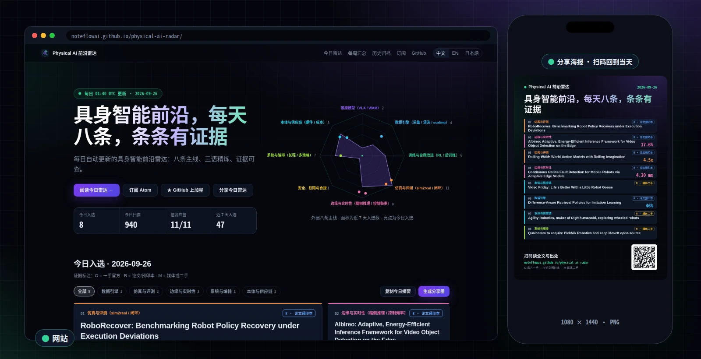
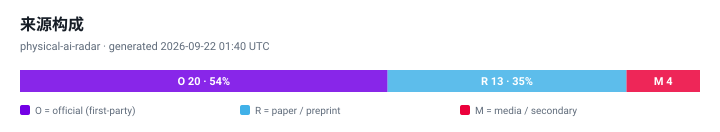
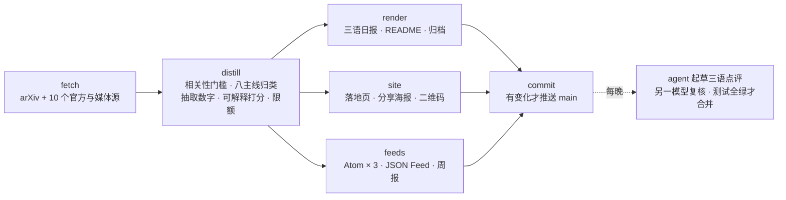

<div align="center">

<a href="https://noteflowai.github.io/physical-ai-radar/"></a>

# Physical AI 前沿雷达

**每天 8 条具身智能前沿，按八条主线归类，每条都标注证据等级，中英日三语写清“为什么重要”。**

[](https://noteflowai.github.io/physical-ai-radar/)
[](https://noteflowai.github.io/physical-ai-radar/radar/feed.zh.xml)
[](radar/INDEX.md)

[](radar/INDEX.md)
[](docs/automation.md)
[](https://github.com/noteflowai/physical-ai-radar/actions/workflows/ci.yml)
[](#本地运行)
[](LICENSE)
[](LICENSE-CONTENT)

**中文** · [English](README.en.md) · [日本語](README.ja.md)

</div>

<table>
<tr>
<td width="50%" valign="top">

**🔎 证据可查，口径不混**<br>
`[O]` 一手官方 · `[R]` 论文预印本 · `[M]` 媒体二手。厂商自报与同行评议不混为一谈。

</td>
<td width="50%" valign="top">

**📏 只留可检验的数字**<br>
自动抽取成功率、延迟、Hz、参数量、数据小时数，并附上原文上下文；没有数字的条目不会被吹成突破。

</td>
</tr>
<tr>
<td width="50%" valign="top">

**🧭 前瞻但不玄学**<br>
自我改进闭环、推理时计算、世界模型评测、运行时安全、合规排期、可靠性经济学——每一条都挂原始链接。

</td>
<td width="50%" valign="top">

**🧪 零依赖可复现**<br>
整条流水线只用 Python 标准库，图表是手写 SVG；`python3 -m pairadar --offline` 在任何机器上跑出同样结果。

</td>
</tr>
</table>

<p align="center"><a href="https://noteflowai.github.io/physical-ai-radar/"></a><br><sub>网站落地页（左）与一键生成的当日分享海报（右） · 2026-09-26 截图</sub></p>

> [!TIP]
> **转发给同事：** 在[网站](https://noteflowai.github.io/physical-ai-radar/)点「生成分享图」，得到一张带二维码的当日海报，适合朋友圈、小红书和 X；「复制今日摘要」则把 8 条标题和链接变成一段纯文本，直接贴进群聊。
>
> **订阅：** [Atom（中文）](https://noteflowai.github.io/physical-ai-radar/radar/feed.zh.xml) · [JSON Feed（英文）](https://noteflowai.github.io/physical-ai-radar/radar/feed.json)，粘贴到任意 RSS 阅读器，每条都带主线、证据等级和关键数字。

<!-- RADAR:START -->
### 今日雷达 · 2026-09-26

`生成时间: 2026-09-26 01:40 UTC` ｜ `统计窗口: 论文 2026-09-22 → 2026-09-26 · 博客与报道 2026-08-27 → 2026-09-26 · 30 天内不重复 (UTC)`

| # | 条目 · 关键数字 |
| :-: | --- |
| 01<br>🔵&nbsp;`R` | **[RoboRecover: Benchmarking Robot Policy Recovery under Execution Deviations](https://arxiv.org/abs/2609.28952)**<br><sub>仿真与评测 · arXiv 2609.28952 · 2026‑09‑25</sub> |
| 02<br>🔵&nbsp;`R` | **[Albireo: Adaptive, Energy-Efficient Inference Framework for Video Object Detection on the Edge](https://arxiv.org/abs/2609.29648)**<br>`17.6%`&nbsp; `14.4%`&nbsp; `24.9%`<br><sub>边缘与实时性 · arXiv 2609.29648 · 2026‑09‑25</sub> |
| 03<br>🔵&nbsp;`R` | **[Rolling-WAM: World Action Models with Rolling Imagination](https://arxiv.org/abs/2609.30247)**<br>`4.5x`<br><sub>仿真与评测 · arXiv 2609.30247 · 2026‑09‑25</sub> |
| 04<br>🔵&nbsp;`R` | **[Continuous Online Fault Detection for Mobile Robots via Adaptive Edge Models](https://arxiv.org/abs/2609.29194)**<br>`4.30 ms`<br><sub>边缘与实时性 · arXiv 2609.29194 · 2026‑09‑25</sub> |
| 05<br>🟡&nbsp;`M` | **[Video Friday: Life’s Better With a Little Robot Goose](https://spectrum.ieee.org/video-friday-goose-household-robots)**<br><sub>本体与供应链 · IEEE Spectrum Robotics · 2026‑09‑25</sub> |
| 06<br>🔵&nbsp;`R` | **[Difference-Aware Retrieval Policies for Imitation Learning](http://www.tri.global/research/difference-aware-retrieval-policies-imitation-learning)**<br>`46%`<br><sub>数据引擎 · Toyota Research Institute · 2026‑09‑09</sub> |
| 07<br>🟡&nbsp;`M` | **[Agility Robotics, maker of Digit humanoid, exploring wheeled robots](https://www.therobotreport.com/agility-robotics-maker-of-digit-humanoid-exploring-wheeled-robots/)**<br><sub>本体与供应链 · The Robot Report · 2026‑09‑25</sub> |
| 08<br>🟡&nbsp;`M` | **[Qualcomm to acquire PickNik Robotics and keep MoveIt open-source](https://www.therobotreport.com/qualcomm-acquires-picknik-robotics-keep-moveit-open-source/)**<br><sub>系统与编排 · The Robot Report · 2026‑09‑23</sub> |

🟢 `O` 官方一手 · 🔵 `R` 论文预印本 · 🟡 `M` 媒体二手

<details><summary><b>为什么重要</b> · 01–08</summary>

1. **RoboRecover** — `AI 起草` 作者指出现有基准多从预设初始状态跑完整轨迹，若你的评测也是如此，就测不到策略偏离后能否恢复；该预印本报告了闭环结果，但本页未见具体数字，请自行核对原文。
2. **Albireo** — `AI 起草` 若你的感知栈在长视频流上逐帧跑检测器，作者自报在 Thor 上省电 17.6%、Orin 上 14.4%，代码已开放；本页没有真机任务或控制回路的结果，先在自己的板子上复测再决定是否接入。
3. **Rolling-WAM** — `AI 起草` 如果你曾因联合视频-动作去噪拖慢每个重规划周期而放弃世界动作模型，作者自报的 4.5x 稳态重规划加速、且附真机闭环结果，值得重新评估；成功率数字本页未给出。
4. **Continuous Online Fault Detection for Mobile Robots via Adaptive Edge Models** — `AI 起草` 作者自报其 Student 模型在 CPU 上单次推理 4.30 ms 且可持续在线适应，意味着故障检测可以不占 GPU 地挂在控制回路旁；页面显示有真机结果，但没有检测触发后闭环处置的验证。
5. **Video Friday** — `AI 起草` 这是一期视频集锦，页面上唯一的文字只提到 The Robot Works 的小机器鹅；把它当成发现硬件线索的入口、再去别处核实，不要把其中任何规格、价格或出货说法当作证据。
6. **Difference-Aware Retrieval Policies for Imitation Learning** — `AI 起草` 若你的行为克隆策略在部署中因误差累积而滑出分布，作者自报的检索式策略比标准行为克隆提升 15-46%；页面未见真机或闭环结果，换方案前先在自己的任务上验证。
7. **Agility Robotics, maker of Digit humanoid, exploring wheeled robots** — `AI 起草` 一家行业媒体报道 Digit 的厂商正在为不同作业环境探索包括轮式在内的多种形态，说明人形优先的厂商也不只押注双足；如果你在选型，直接问厂商哪种形态在实际交付。
8. **Qualcomm to acquire PickNik Robotics and keep MoveIt open-source** — `AI 起草` 如果 MoveIt 在你的操作栈里，报道称高通将保持其开源并接入 Dragonwing 与 Arduino 平台，短期风险是路线图向单一芯片厂商倾斜，而非许可证变更；请以官方公告为准。

</details>

**[今日雷达 ›](radar/daily/2026-09-26.zh.md)** · [每周汇总 ›](radar/weekly/2026-W39.zh.md) · [历史归档 ›](radar/INDEX.md)



<!-- RADAR:END -->

## 和常见信息源有什么不同

| | **Physical AI 前沿雷达** | 行业通讯 | awesome 列表 | arXiv 每日列表 |
| --- | --- | --- | --- | --- |
| 更新 | 每天 07:40 Asia/Singapore，自动 | 每周或不定期 | 随贡献 | 每天 |
| 范围 | 论文 + 官方 + 媒体，八条主线 | 编辑选题 | 按主题累积 | 只有论文，全量 |
| 证据等级 | 每条标 `O` / `R` / `M` | 通常不标 | 不标 | 只有论文 |
| 关键数字 | 自动抽取，附原文上下文 | 看作者 | — | 自己读 |
| 语言 | 中 / 英 / 日各自成文 | 通常单语 | 通常英文 | 英文 |
| 机器可读 | Atom × 3 · JSON Feed · `latest.json` | 邮件 | Markdown | RSS / API |
| 可复现 | 规则与权重全在仓库里，离线可重跑 | — | — | — |

它不替代通讯的深度评论，也不替代 arXiv 的全量——它是每天早上先看的那一页。

## 八条主线

| 主线 | 关注什么 | 为什么值得单独看 |
| --- | --- | --- |
| 基座模型（VLA / WAM） | 视觉-语言-动作模型、世界动作模型、开放权重 | 决定下游任务的起点与跨本体迁移能力 |
| 数据引擎 | 遥操作、第一人称人类视频、清洗与 scaling | 决定单位新任务的数据成本 |
| 训练与自我改进 | RL 后训练、advantage conditioning、车队级回流 | 决定策略部署后还能不能继续变强 |
| 仿真与评测 | sim2real、real-to-sim、闭环成功率、评测平台 | 离线指标不等于闭环成功率 |
| 边缘与实时性 | 端侧推理、量化、异步推理、控制频率 | 超出实时预算的模型进不了控制回路 |
| 安全、权限与合规 | 安全过滤器、CBF、ISO / 法规时间表 | 认证空窗期里安全靠架构而非合格证 |
| 系统与编排 | 长程任务、编排器、记忆、多策略路由 | 运维对象从"一个模型"变成"一组能力边界" |
| 本体与供应链 | 人形、执行器、触觉、BOM 与产线 | 成本曲线与交付节奏的实际限速器 |

## 怎么读

1. **先看证据标注再看结论**。`[R]` 的数字是作者自报，`[M]` 的出货量常有口径冲突，`[O]` 也要区分"平台可用"和"客户已部署"。
2. **关键数字优先于形容词**。每条尽量给出成功率、延迟、数据量；没有数字说明这条还在叙事阶段。
3. **合规看日期**。标准与法规条目直接给生效或阶段日期，方便抄进项目计划。

## 拿去用：订阅与数据

全部是 GitHub Pages 上的静态文件，不需要账号或 key。

| 你想要 | 地址 |
| --- | --- |
| RSS 阅读器 | [中文 Atom](https://noteflowai.github.io/physical-ai-radar/radar/feed.zh.xml) · [英文 Atom](https://noteflowai.github.io/physical-ai-radar/radar/feed.xml) · [日文 Atom](https://noteflowai.github.io/physical-ai-radar/radar/feed.ja.xml) |
| 程序读取当天 | [`radar/latest.json`](https://noteflowai.github.io/physical-ai-radar/radar/latest.json)：每条的主线、证据、分数、数字 |
| JSON Feed | [`radar/feed.json`](https://noteflowai.github.io/physical-ai-radar/radar/feed.json) |
| 推到 Slack / 飞书 / Discord | 任何支持 RSS 的机器人订阅上面的 Atom 即可 |

```bash
R=https://noteflowai.github.io/physical-ai-radar/radar
# 今天的 8 条：证据等级、主线、标题
curl -s $R/latest.json | jq -r '.picked[] | "[\(.evidence)] \(.lane)\t\(.title)"'
# 只看带可核对数字的
curl -s $R/latest.json | jq -r '.picked[] | select(.numbers | length > 0) | "\(.numbers | join(", "))\t\(.title)"'
# 最近 10 条（JSON Feed 1.1）
curl -s $R/feed.json | jq -r '.items[:10][] | "\(.date_published[:10])  \(.title)  \(.url)"'
```

内容以 [CC BY 4.0](LICENSE-CONTENT) 授权：转载、做周报、喂给你自己的 agent 都可以，注明出处并链接回原条目即可。

## 自动更新机制



`scripts/publish_daily.sh` 每天在新加坡时间 07:40（前一日 23:40 UTC / 08:40 JST）发布早报，日报日期按新加坡日历计算。07:40 早于 arXiv 当日常规公告；21:30 的统一夜间批次会补采新热点，完成雷达分析和三个关联项目的优化，次日 02:30 自动补跑未完成步骤。

<details>
<summary>各步骤明细</summary>

```
scripts/publish_daily.sh（维护者机器上的 cron，07:40 Asia/Singapore / 08:40 JST）
  └─ fetch    arXiv API（六组 cs.RO 查询，API 不可用时改读分类 RSS）+ 官方与媒体 Atom/RSS（AWS / NVIDIA / DeepMind / HF / TRI / IEEE / The Robot Report / 雷峰网 / MONOist）
  └─ distill  相关性门槛 → 归类到八条主线 → 抽取量化指标 → 可解释打分 → 每主线、每来源、每证据等级限额筛选
  └─ charts   手写 SVG：主线分布 / 每日节奏 / 证据构成 / README 横幅
  └─ render   生成三语日报 + 注入三份 README + 更新归档索引与 latest.json
  └─ feeds    radar/feed.json（JSON Feed 1.1）+ 每种语言一份 Atom + 本周汇总（radar/weekly/）
  └─ site     落地页 index.html · en/ · ja/（深色主题、雷达图、分享海报与二维码）
  └─ commit   有变化才提交并推送到 main
```

</details>

## 本地运行

```bash
git clone https://github.com/noteflowai/physical-ai-radar.git
cd physical-ai-radar

python3 -m pairadar --offline --out /tmp/radar   # 不联网，产物写到别处，不改动仓库
python3 -m pairadar --offline                   # 不联网，直接改写仓库内的日报与 README
python3 -m pairadar                             # 联网抓取当日新内容
python3 -m unittest discover -s tests           # 测试
```

无需 pip install，无需虚拟环境，Python 3.10+ 即可。

不带 `--out` 的运行会**就地改写**三份 README 的雷达区块、`radar/` 与 `assets/`
（这正是每日任务要做的事）；想先看看产出，用 `--out` 写到别处。
两种方式都会从仓库读取运行日志，所以"30 天内不重复"仍然生效。

<details>
<summary>目录结构</summary>

```
data/        sources.json（源与权重）· taxonomy.json（主线与信号）
             glossary.json（三语 UI 与术语）· baseline.json（人工策展基线）
pairadar/    fetch / distill / charts / banner / render / site / qr / cli —— 全部标准库
radar/       daily/YYYY-MM-DD.{zh,en,ja}.md · INDEX.md · latest.json · history.json
assets/      自动生成的 SVG 图与 README 横幅 · site.css · site.js · 社交分享卡 og.*.png
             · showcase.*.webp（README 里的网站与海报截图，手动截取）
docs/        METHODOLOGY.md（方法论、翻译策略与已知局限）
```

</details>

## 已知局限（先说清楚）

- 摘要是**抽取式**的：英文原文摘录会标为引用块，不做机器翻译。上方的分析层**按语言分别成文**，从不逐句翻译：多数日子由 agent 起草，每行都标注为起草，其中的数字必须已出现在当天已发布的页面上；没有起草的语言由主线模板补位，不加标注。[起草如何被复核、以及它不得声称什么](docs/METHODOLOGY.md)。
- 图表**按语言各出一套**，标签用各自的语言。它们是 SVG 文本，字形由读者浏览器提供，仓库不内置任何字体。过长的名称在 `data/taxonomy.json` 里配有人工短形；仅当仍然放不下时才截断，而一个测试确保当前一条也没被截断。
- 主线归类是**关键词匹配**（整词匹配，不做子串匹配），不是分类模型：来自综合博客的条目还须命中一个 Physical AI 锚定词（robot、humanoid、VLA、world model 等），至少命中一个关键词才会归入某主线，`python3 -m pairadar.lanes` 会标出仅由单个关键词决定（`thin`）或与次选过于接近（`ambiguous`）的条目。归错主线是**可被发现**的，但不是被阻止的。

## 刻意的选择（不是局限）

这几条不会被"修掉"——正是它们让其余部分可核对。

- 排序是**可解释的加权和**，不是学习到的相关性；权重都写在 `data/` 里，可以 fork 后自行调整。agent 可以提议新权重并走一个你读得懂的 PR，但它不能把这个模型换成你读不懂的那种。
- 源限定为公开的机器可读端点，不抓取正文、不绕过付费墙。这一条是**被强制执行**的,不只是承诺：起草与复核 agent 只声明 `read`、`grep`、`glob` —— 没有 shell、没有联网 —— 它们只能在流水线已抓取并发布的内容上推理，并且有测试守住这一点。

## 相关项目

雷达追踪前沿结论，[**Robot Reel**](https://huggingface.co/spaces/glayguo/robot-reel) 做的是另一半：把其中一类结论录制成可检查的证据。

- [SmolVLA Stress Lab](https://noteflowai.github.io/robot-reel/stress/) —— 同一任务在参考光照／降低光照／换视角下的 30 次真实闭环运行（NVIDIA L40S / CUDA 推理），成对种子、置信区间、逐帧动作与推理计时
- [Butterfly Lab](https://noteflowai.github.io/robot-reel/chaos/) —— 十二个 Newton 世界，释放角相差 0.05°，轨迹长成 3D 时间雕塑
- [配对结果数据集](https://huggingface.co/datasets/glayguo/robot-reel-paired-outcomes) —— 可直接读取的运行结果

雷达上"边缘与实时性""仿真与评测"两条主线里的结论，在那边通常能找到一个可以点开看的对照实验。

**披露**：两个项目由同一批作者维护。因此雷达的策展基线（`data/baseline.json`）不收录自家项目，上面的链接只出现在这里。

## 贡献

欢迎 PR：新增源（需机器可读）、修正证据标注、补充策展基线、改进三语措辞。请先读 [CONTRIBUTING.md](CONTRIBUTING.md) 与 [docs/METHODOLOGY.md](docs/METHODOLOGY.md)。

## 许可

- 代码：[MIT](LICENSE)
- 内容（策展文字与生成页面）：[CC BY 4.0](LICENSE-CONTENT)


<div align="center">

**觉得有用？点个 ⭐ Star，明早 07:40 Asia/Singapore 见。** 转发今天的雷达：[网站](https://noteflowai.github.io/physical-ai-radar/) ·
[分享到 X](https://twitter.com/intent/tweet?text=Physical%20AI%20%E5%89%8D%E6%B2%BF%E9%9B%B7%E8%BE%BE%EF%BC%9A%E6%AF%8F%E5%A4%A9%208%20%E6%9D%A1%EF%BC%8C%E6%9D%A1%E6%9D%A1%E6%9C%89%E8%AF%81%E6%8D%AE&url=https%3A%2F%2Fgithub.com%2Fnoteflowai%2Fphysical-ai-radar) ·
[分享到微博](https://service.weibo.com/share/share.php?url=https%3A%2F%2Fgithub.com%2Fnoteflowai%2Fphysical-ai-radar&title=Physical%20AI%20%E5%89%8D%E6%B2%BF%E9%9B%B7%E8%BE%BE%EF%BC%9A%E6%AF%8F%E5%A4%A9%208%20%E6%9D%A1%EF%BC%8C%E6%9D%A1%E6%9D%A1%E6%9C%89%E8%AF%81%E6%8D%AE)

</div>

---

*本仓库为技术观察，不构成投资建议、产品承诺或安全认证结论。论文与厂商结论均以其自报为准，引用前请回到原始链接核对。*
