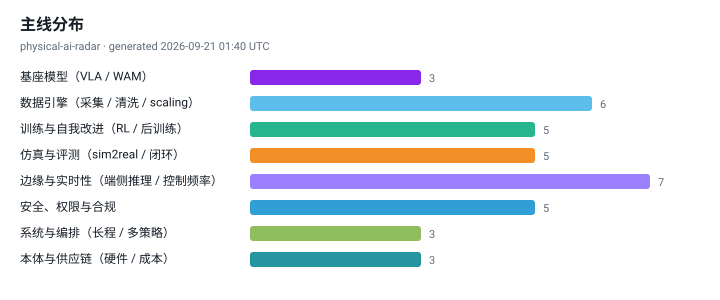
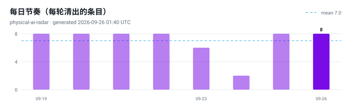

# Physical AI 前沿雷达 · Physical AI Radar

[](radar/INDEX.md)
[](https://raw.githubusercontent.com/noteflowai/physical-ai-radar/main/radar/feed.zh.xml)
[](https://github.com/noteflowai/physical-ai-radar/actions/workflows/ci.yml)
[](LICENSE)
[](LICENSE-CONTENT)
[](docs/automation.md)

**语言：中文 · [English](README.en.md) · [日本語](README.ja.md)**

每天自动更新的具身智能（Physical AI）前沿雷达。它只做三件事：**按八条主线归类**、**给每条结论标注证据等级**、**用中英日三语写清"为什么重要"**。

与"论文列表"或"新闻聚合"的区别：

- **证据可查，口径不混**：`[O]` 一手官方 / `[R]` 论文预印本 / `[M]` 媒体二手，厂商自报与同行评议不混为一谈。
- **只留可检验的数字**：自动抽取成功率、延迟、Hz、参数量、数据小时数等量化指标，没有数字的条目不会被吹成突破。
- **前瞻但不玄学**：雷达覆盖自我改进闭环、推理时计算、世界模型评测、运行时安全、合规排期与可靠性经济学——每一条都挂原始链接。
- **零依赖可复现**：整条流水线只用 Python 标准库，图表是手写 SVG，任何人都能在本地跑出同样结果。

**订阅：** [Atom（中文）](https://raw.githubusercontent.com/noteflowai/physical-ai-radar/main/radar/feed.zh.xml) · [JSON Feed（英文）](https://raw.githubusercontent.com/noteflowai/physical-ai-radar/main/radar/feed.json) · [每周汇总](radar/INDEX.md)。把链接粘贴到任意 RSS 阅读器即可，每条都带主线、证据等级和关键数字。

<!-- RADAR:START -->
### 今日雷达 · 2026-09-24

`生成时间: 2026-09-24 01:40 UTC` ｜ `统计窗口: 2026-09-21 → 2026-09-24 (UTC)`

- `[O]` **[At AI Day Singapore, NVIDIA and Partners Showcase AI Advancements Across Southeast Asia](https://blogs.nvidia.com/blog/ai-day-singapore/)** — 训练与自我改进（RL / 后训练）
  - 后训练与自我改进决定策略在部署后还能不能变强，也决定运维是否要收集干预数据。
- `[O]` **[How to Use NVIDIA Warp and MjWarp to Accelerate Robotics Simulation and Learning Workflows](https://huggingface.co/blog/nvidia/how-to-use-nvidia-warp-and-mjwarp)** — 仿真与评测（sim2real / 闭环）
  - 评测方式决定你敢不敢上线：离线指标不等于闭环成功率，评测预算结构正在从人力转向 GPU 小时。

[今日雷达 ›](radar/daily/2026-09-24.zh.md) · [历史归档 ›](radar/INDEX.md)




<!-- RADAR:END -->

## 八条主线

| 主线 | 关注什么 | 为什么值得单独看 |
| --- | --- | --- |
| 基座模型（VLA / WAM） | 视觉-语言-动作模型、世界动作模型、开放权重 | 决定下游任务的起点与跨本体迁移能力 |
| 数据引擎 | 遥操作、第一人称人类视频、清洗与 scaling | 决定单位新任务的数据成本 |
| 训练与自我改进 | RL 后训练、advantage conditioning、车队级回流 | 决定策略部署后还能不能继续变强 |
| 仿真与评测 | sim2real、real-to-sim、闭环成功率、评测平台 | 离线指标不等于闭环成功率 |
| 边缘与实时性 | 端侧推理、量化、异步推理、控制频率 | 超出实时预算的模型进不了控制回路 |
| 安全、权限与合规 | 安全过滤器、CBF、ISO / 法规时间表 | 认证空窗期里安全靠架构而非合格证 |
| 系统与编排 | 长程任务、编排器、记忆、多策略路由 | 运维对象从"一个模型"变成"一组能力边界" |
| 本体与供应链 | 人形、执行器、触觉、BOM 与产线 | 成本曲线与交付节奏的实际限速器 |

## 怎么读

1. **先看证据标注再看结论**。`[R]` 的数字是作者自报，`[M]` 的出货量常有口径冲突，`[O]` 也要区分"平台可用"和"客户已部署"。
2. **关键数字优先于形容词**。每条尽量给出成功率、延迟、数据量；没有数字说明这条还在叙事阶段。
3. **合规看日期**。标准与法规条目直接给生效或阶段日期，方便抄进项目计划。

## 自动更新机制

```
scripts/publish_daily.sh（维护者机器上的 cron，01:40 UTC / 09:40 CST / 10:40 JST）
  └─ fetch    arXiv API（六组 cs.RO 查询，API 不可用时改读分类 RSS）+ 官方与媒体 Atom/RSS（AWS / NVIDIA / DeepMind / HF / IEEE / The Robot Report）
  └─ distill  相关性门槛 → 归类到八条主线 → 抽取量化指标 → 可解释打分 → 每主线、每来源、每证据等级限额筛选
  └─ charts   手写 SVG：主线分布 / 每日节奏 / 证据构成
  └─ render   生成三语日报 + 注入三份 README + 更新归档索引与 latest.json
  └─ feeds    radar/feed.json（JSON Feed 1.1）+ 每种语言一份 Atom + 本周汇总（radar/weekly/）
  └─ commit   有变化才提交并推送到 main
```

时间点选在 arXiv 当日公告之后，保证早上第一眼看到的是最新一批。

## 本地运行

```bash
git clone https://github.com/noteflowai/physical-ai-radar.git
cd physical-ai-radar

python3 -m pairadar --offline --out /tmp/radar   # 不联网，产物写到别处，不改动仓库
python3 -m pairadar --offline                   # 不联网，直接改写仓库内的日报与 README
python3 -m pairadar                             # 联网抓取当日新内容
python3 -m unittest discover -s tests           # 测试
```

无需 pip install，无需虚拟环境，Python 3.10+ 即可。

不带 `--out` 的运行会**就地改写**三份 README 的雷达区块、`radar/` 与 `assets/`
（这正是每日任务要做的事）；想先看看产出，用 `--out` 写到别处。
两种方式都会从仓库读取运行日志，所以"七天内不重复"仍然生效。

## 目录结构

```
data/        sources.json（源与权重）· taxonomy.json（主线与信号）
             glossary.json（三语 UI 与术语）· baseline.json（人工策展基线）
pairadar/    fetch / distill / charts / render / cli —— 全部标准库
radar/       daily/YYYY-MM-DD.{zh,en,ja}.md · INDEX.md · latest.json · history.json
assets/      自动生成的 SVG 图
docs/        METHODOLOGY.md（方法论、翻译策略与已知局限）
```

## 已知局限（先说清楚）

- 摘要是**抽取式**的：英文原文摘录会标为引用块，不做机器翻译。上方的分析层**按语言分别成文**，从不逐句翻译：多数日子由 agent 起草，每行都标注为起草，其中的数字必须已出现在当天已发布的页面上；没有起草的语言由主线模板补位，不加标注。[起草如何被复核、以及它不得声称什么](docs/METHODOLOGY.md)。
- 图表**按语言各出一套**，标签用各自的语言。它们是 SVG 文本，字形由读者浏览器提供，仓库不内置任何字体。过长的名称在 `data/taxonomy.json` 里配有人工短形；仅当仍然放不下时才截断，而一个测试确保当前一条也没被截断。
- 主线归类是**关键词匹配**（整词匹配，不做子串匹配），不是分类模型：来自综合博客的条目还须命中一个 Physical AI 锚定词（robot、humanoid、VLA、world model 等），至少命中一个关键词才会归入某主线，`python3 -m pairadar.lanes` 会标出仅由单个关键词决定（`thin`）或与次选过于接近（`ambiguous`）的条目。归错主线是**可被发现**的，但不是被阻止的。

## 刻意的选择（不是局限）

这几条不会被"修掉"——正是它们让其余部分可核对。

- 排序是**可解释的加权和**，不是学习到的相关性；权重都写在 `data/` 里，可以 fork 后自行调整。agent 可以提议新权重并走一个你读得懂的 PR，但它不能把这个模型换成你读不懂的那种。
- 源限定为公开的机器可读端点，不抓取正文、不绕过付费墙。这一条是**被强制执行**的,不只是承诺：起草与复核 agent 只声明 `read`、`grep`、`glob` —— 没有 shell、没有联网 —— 它们只能在流水线已抓取并发布的内容上推理，并且有测试守住这一点。

## 相关项目

雷达追踪前沿结论，[**Robot Reel**](https://huggingface.co/spaces/glayguo/robot-reel) 做的是另一半：把其中一类结论录制成可检查的证据。

- [SmolVLA Stress Lab](https://noteflowai.github.io/robot-reel/stress/) —— 同一任务在参考光照／降低光照／换视角下的 30 次真实闭环运行（NVIDIA L40S / CUDA 推理），成对种子、置信区间、逐帧动作与推理计时
- [Butterfly Lab](https://noteflowai.github.io/robot-reel/chaos/) —— 十二个 Newton 世界，释放角相差 0.05°，轨迹长成 3D 时间雕塑
- [配对结果数据集](https://huggingface.co/datasets/glayguo/robot-reel-paired-outcomes) —— 可直接读取的运行结果

雷达上"边缘与实时性""仿真与评测"两条主线里的结论，在那边通常能找到一个可以点开看的对照实验。

**披露**：两个项目由同一批作者维护。因此雷达的策展基线（`data/baseline.json`）不收录自家项目，上面的链接只出现在这里。

## 贡献

欢迎 PR：新增源（需机器可读）、修正证据标注、补充策展基线、改进三语措辞。请先读 [CONTRIBUTING.md](CONTRIBUTING.md) 与 [docs/METHODOLOGY.md](docs/METHODOLOGY.md)。

## 许可

- 代码：[MIT](LICENSE)
- 内容（策展文字与生成页面）：[CC BY 4.0](LICENSE-CONTENT)

---

*本仓库为技术观察，不构成投资建议、产品承诺或安全认证结论。论文与厂商结论均以其自报为准，引用前请回到原始链接核对。*
