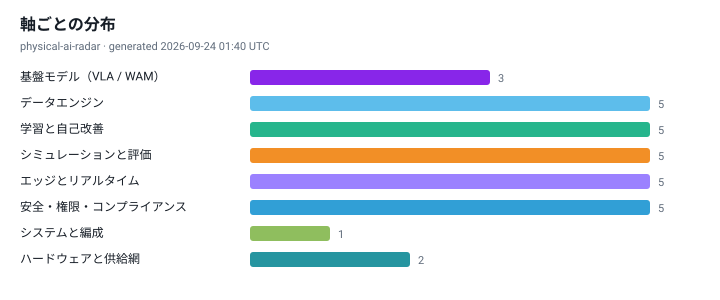
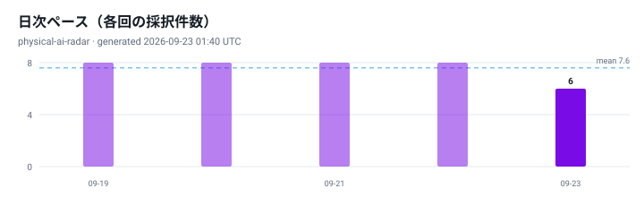
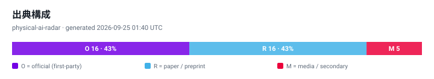

# Physical AI フロンティア・レーダー · 2026-09-24

言語：[ZH](./2026-09-24.zh.md) · [EN](./2026-09-24.en.md) · 日本語

> フィジカルAIの最前線を毎日更新：8つの軸、三言語の要約、追跡可能な根拠。

- 生成時刻: `2026-09-24 01:40 UTC`
- 対象期間: `2026-09-21 → 2026-09-24 (UTC)`
- 根拠タグ：O = 一次情報 · R = 論文/プレプリント · M = メディア/二次情報

## 本日の注目

### 1. At AI Day Singapore, NVIDIA and Partners Showcase AI Advancements Across Southeast Asia

- **軸**: 学習と自己改善（RL / 事後学習） ｜ **根拠**: `[O]` ｜ **出典**: [NVIDIA Blog](https://blogs.nvidia.com/blog/ai-day-singapore/) ｜ `2026-09-23`
- **重要な理由**: 事後学習と自己改善は、配備後も方策が強くなれるか、運用で介入データを取る必要があるかを決める。

> NVIDIA AI Day Singapore, which takes place Sept. 22-23 at the Raffles City Convention Centre, is offering attendees opportunities to explore the hands-on training, expert-led sessions and advanced tools to accelerate their work in AI and…

### 2. How to Use NVIDIA Warp and MjWarp to Accelerate Robotics Simulation and Learning Workflows

- **軸**: シミュレーションと評価（sim2real / 閉ループ） ｜ **根拠**: `[O]` ｜ **出典**: [Hugging Face Blog](https://huggingface.co/blog/nvidia/how-to-use-nvidia-warp-and-mjwarp) ｜ `2026-09-23`
- **重要な理由**: 評価手法が出荷判断を決める：オフライン指標は閉ループ成功率ではなく、評価予算は人手からGPU時間へ移りつつある。

## フロンティア基準（キュレーション）

### 1. RoboTTT: context scaling for robot policies via test-time training

- **軸**: エッジとリアルタイム（オンデバイス推論 / 制御周期） ｜ **根拠**: `[R]` ｜ **出典**: [arXiv 2607.15275 (NVIDIA)](https://arxiv.org/pdf/2607.15275) ｜ `2026-07-16`
- **主要数値**: `8K timestep visuomotor context` · `3 orders of magnitude beyond prior policies` · `no inference-latency growth`
- 遅延・制御周期の数値あり
- **重要な理由**: 遅延を増やさず長い文脈を方策に導入。ワンショット模倣と実行中の改善を同一の推論で扱える。

### 2. Newton: open-source GPU physics engine for robotics (NVIDIA, Google DeepMind, Disney Research)

- **軸**: シミュレーションと評価（sim2real / 閉ループ） ｜ **根拠**: `[O]` ｜ **出典**: [NVIDIA Developer](https://developer.nvidia.com/blog/announcing-newton-an-open-source-physics-engine-for-robotics-simulation) ｜ `2026`
- **主要数値**: `built on Warp + OpenUSD` · `MuJoCo Warp up to 152x (locomotion) / 313x (manipulation) vs MJX on RTX 4090`
- コードまたは重み公開
- **重要な理由**: 微分可能な新しいシミュレーション基盤とIsaac Labのバックエンド切替により、学習と評価で同じアクチュエータ設定を再利用できる。

### 3. GR00T N1.7: open reasoning VLA model for humanoid robots

- **軸**: 基盤モデル（VLA / WAM） ｜ **根拠**: `[O]` ｜ **出典**: [NVIDIA / Hugging Face](https://huggingface.co/blog/nvidia/gr00t-n1-7) ｜ `2026`
- **主要数値**: `3B parameters` · `open weights`
- 遅延・制御周期の数値あり
- **重要な理由**: 3B級のオープンな推論VLAにより、社内チームは基盤モデルを自作せずに微調整・配備を始められる。

### 4. HumanEgo: zero-shot robot learning from minutes of human egocentric video

- **軸**: データエンジン（収集 / 精査 / スケーリング） ｜ **根拠**: `[R]` ｜ **出典**: [arXiv 2605.24934](https://arxiv.org/html/2605.24934v1) ｜ `2026`
- **主要数値**: `30 min/task -> 92.5% average success on 4 real tasks` · `15 min -> 75%` · `+41% over matched-time teleoperation`
- **重要な理由**: 新規タスクあたりのデータコストを分単位まで下げる。データ戦略の遅れを測る最も直接的な基準。

### 5. Regulation (EU) 2023/1230 becomes fully applicable

- **軸**: 安全・権限・コンプライアンス ｜ **根拠**: `[O]` ｜ **出典**: [EUR-Lex / TUV SUD](https://eur-lex.europa.eu/eli/reg/2023/1230/oj/eng) ｜ `2027-01-20`
- **主要数値**: `fully applicable 2027-01-20` · `replaces Directive 2006/42/EC`
- **重要な理由**: プロジェクト計画にそのまま書ける確定日。以後、非適合機械はEU市場に投入できない。

### 6. PL-CBF: finite-horizon safety at runtime via parallel fallback rollouts

- **軸**: 安全・権限・コンプライアンス ｜ **根拠**: `[R]` ｜ **出典**: [arXiv 2605.16588](https://arxiv.org/html/2605.16588) ｜ `2026`
- **主要数値**: `library of fallback policies` · `least-invasive safe mode` · `QP minimally modifies the nominal policy`
- **重要な理由**: 「最小侵襲のフォールバック」は顧客の受入基準にそのまま書ける。「安全です」より具体的。

## 軸ごとの分布

| 軸 | # |
| --- | --- |
| 基盤モデル（VLA / WAM） | 3 |
| データエンジン（収集 / 精査 / スケーリング） | 5 |
| 学習と自己改善（RL / 事後学習） | 5 |
| シミュレーションと評価（sim2real / 閉ループ） | 5 |
| エッジとリアルタイム（オンデバイス推論 / 制御周期） | 5 |
| 安全・権限・コンプライアンス | 5 |
| システムとオーケストレーション（長期タスク / 複数方策） | 1 |
| ハードウェアとサプライチェーン（機体 / コスト） | 2 |

## 直近の推移

## 標準・規制ウォッチ

- [ISO 25785-1 — Safety requirements for dynamically stable industrial mobile robots](https://www.iso.org/standard/91469.html) — Under development; committee-stage as of 2026-09.
- [Regulation (EU) 2023/1230 (Machinery Regulation)](https://eur-lex.europa.eu/eli/reg/2023/1230/oj/eng) — Fully applicable 2027-01-20.
- [EU AI Act official timeline (Council of the EU)](https://www.consilium.europa.eu/en/policies/artificial-intelligence-act/timeline-artificial-intelligence/) — High-risk deadlines 2027-12-02 / 2028-08-02 per Digital Omnibus.

---

*本リポジトリは技術観察であり、投資助言・製品保証・安全認証の結論ではありません。論文の主張は著者による自己報告です。*

[方法論](../../docs/METHODOLOGY.md) · [アーカイブ](../INDEX.md)
